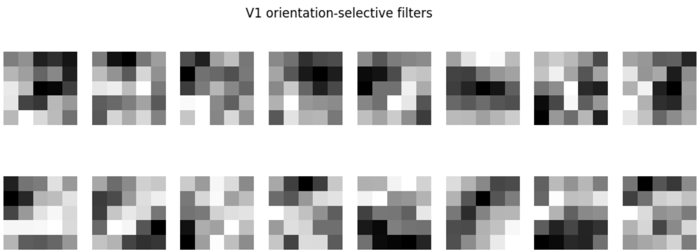
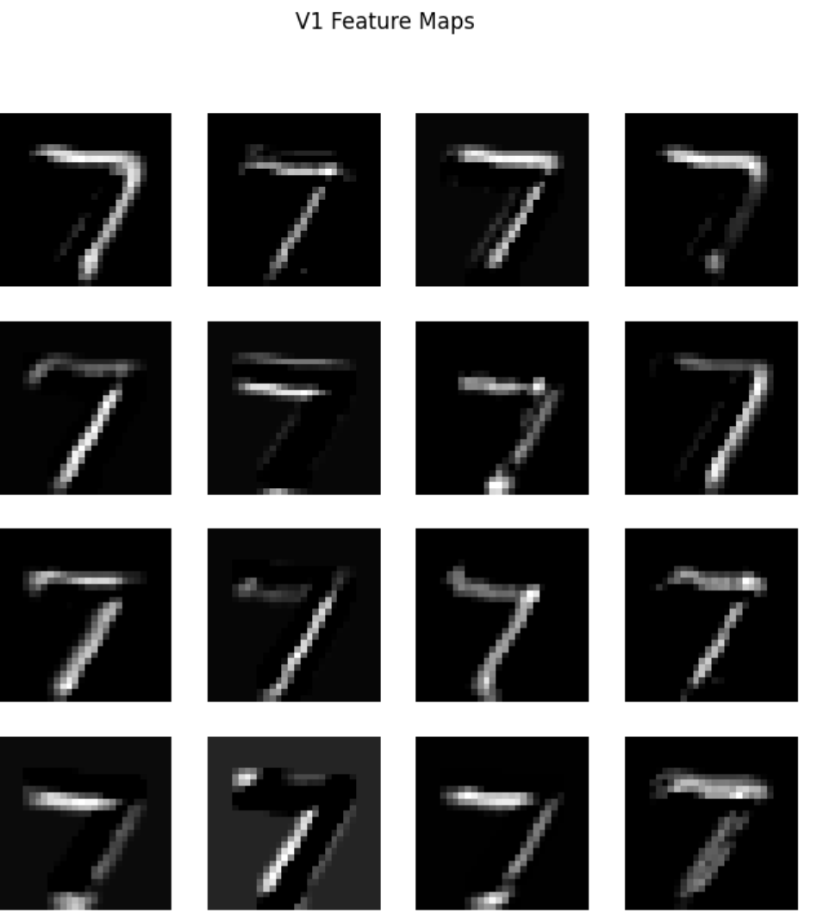
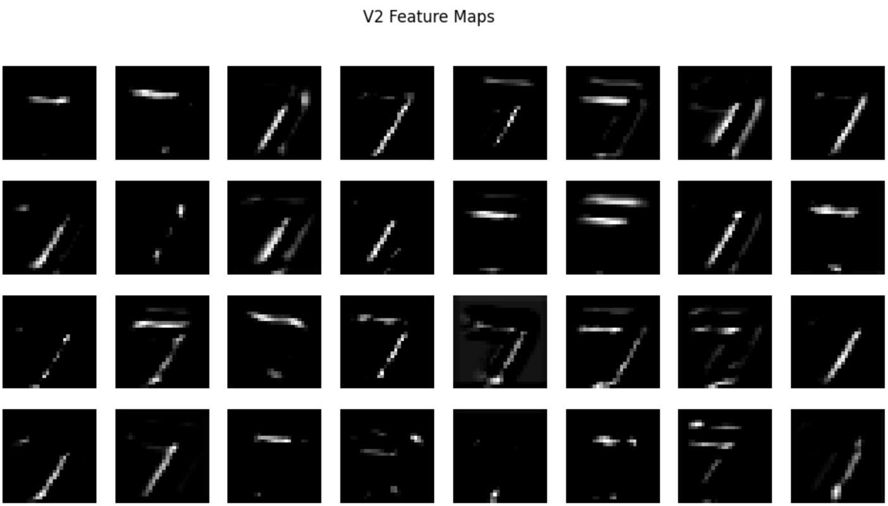

# neurocnn-visual-cortex
A CNN model simulating V1-V2 hierarchical visual processing for neuroscience coursework.
# 使用两层卷积神经网络模拟视觉皮层 V1–V2 的层级加工  
本项目基于卷积神经网络（CNN），模拟生物视觉皮层中 **V1（初级视皮层）** 与 **V2（次级视皮层）** 对视觉信息的处理方式。  
通过训练模型解决 MNIST 手写数字识别任务，我们可以观察到神经网络中不同卷积层呈现出与生物神经元类似的感受野特性与分层表征结构。

---

## 1. 研究背景

在神经科学中，视觉信息的加工是高度层级化（hierarchical）的：

- **V1 simple cells（简单细胞）**  
  对局部小区域敏感，典型特性为 **方向选择性（orientation selectivity）**。  
  感受野小，负责检测边缘、线段等基础特征。

- **V2 complex cells（复杂细胞）**  
  感受野更大，会整合多个 V1 细胞的输出，  
  形成更复杂的特征，如角点、曲线组合、笔画结构等。

本项目使用 CNN 的两层卷积结构模拟这一分层加工过程，并通过可视化卷积核与激活图，展示人工神经网络与生物视觉系统的对应关系。

---

## 2. 模型结构（类比视觉皮层）

模型结构包含两层卷积层与一层全连接分类层：
Input (28×28)
↓
Conv1 (16 filters, 5×5) → ReLU → MaxPool
↓
Conv2 (32 filters, 5×5) → ReLU → MaxPool
↓
Fully Connected Layer → 10 类分类

- **Conv1 → 模拟 V1 simple cells**  
  - 小感受野（5×5）  
  - 学习方向选择性与边缘检测  
  - 输出 16 个特征图  

- **Conv2 → 模拟 V2 complex cells**  
  - 更大感受野（叠加池化效果）  
  - 从边缘组合成更复杂的笔画、结构  
  - 输出 32 个特征图  

---

## 3. 训练与测试

- 数据集：MNIST（60,000 训练图像 + 10,000 测试图像）  
- 损失函数：CrossEntropyLoss  
- 优化器：Adam (lr=0.001)  
- Epochs: 5  

模型在测试集上可达到 **约 98–99% 准确率**，说明其已经学会稳定识别笔画结构。

---

## 4. 感受野与卷积核可视化（V1 模拟）

下图展示 Conv1（第一层卷积）的权重，它们学习到了类似 **V1 方向选择性滤波器** 的结构：

- 明显的水平、垂直、斜线边缘检测  
- 小的局部感受野，结构接近 Gabor 滤波器

### 🧠 V1 卷积核（Conv1 Filters）



---

## 5. V1 及 V2 分层响应可视化（特征图）

### 🧠 5.1 V1 Feature Maps  
展示第一层神经元对输入数字图像不同部分的响应：



特点：

- 某些滤波器对水平线段敏感  
- 某些对垂直边缘或斜线笔画有强响应  
- 这与生物 V1 方向选择性高度一致  

---

### 🧠 5.2 V2 Feature Maps  
第二层卷积提取更复杂视觉特征：



特点：

- 响应范围更大（有效感受野扩大）  
- 出现对笔画组合、角点、局部形状敏感的单元  
- 类似于生物 V2 的组合特征（complex features）  

---

## 6. 损伤实验（Lesion Study）

为模拟生物视觉皮层损伤，本项目引入 V1 卷积核部分“关闭”（置零）的实验：

```python
damaged_model = copy.deepcopy(model)
with torch.no_grad():
    damaged_model.conv1.weight[:8] = 0
    damaged_model.conv1.bias[:8] = 0
```
观察现象：

识别准确率显著下降，实验中测试准确率仅为91%

V1 → V2 的信息传输受损，与真实 V1 损伤现象一致

这一结果揭示了 低级视觉特征对高级视觉识别的重要性。

## 7. 总结

本项目构建了一个两层卷积神经网络作为视觉皮层 V1–V2 的计算模型，通过卷积核可视化、特征图分析以及损伤实验，展示了人工神经网络在视觉分层加工中的生物启发结构。模型训练过程中自然涌现出类似 V1 简单细胞的方向选择性响应，以及 V2 层对更复杂特征的组合编码，体现了深度学习模型与生物视觉系统的结构相似性。

通过对模型的实验分析，本项目表明：层级卷积架构不仅在工程上高效，也能够从计算角度解释早期视觉皮层的功能组织。该模型可以作为进一步探索视觉处理机制（如注意、反馈、损伤恢复等）的基础框架。
